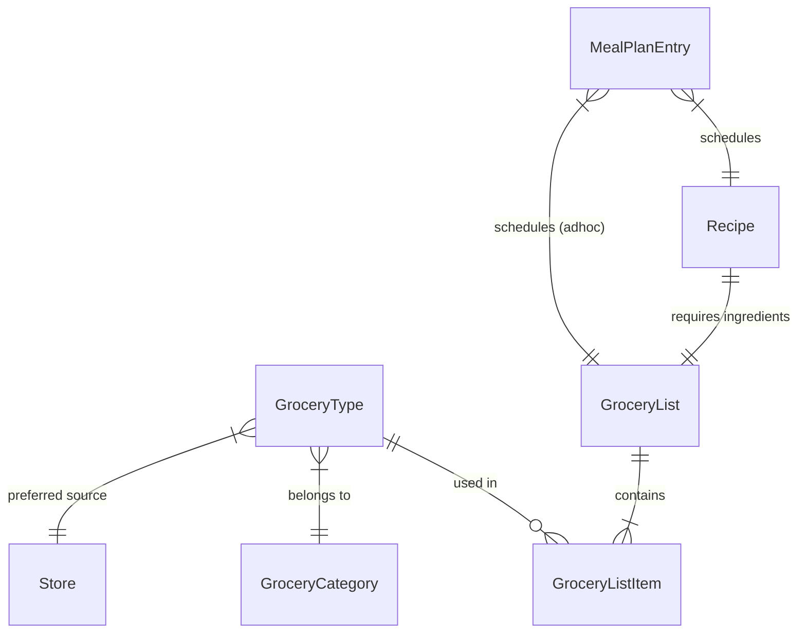

# Data Schema Design

## Overview
Based on the defined user stories, we need to structure our data to support:
1.  **Library/Database** of ingredients and recipes (Administration).
2.  **Planning** of meals over time (Calendar).
3.  **Execution** of shopping (generated lists) and cooking.

## Core Entities

### 1. The Pantry (Reference Data)
**`GroceryType` (The blueprint)**
*User Story 1.1: Define category, preferred store.*
*   `id`: unique string
*   `name`: string (e.g., "Basmati Rice")
*   `categoryId`: reference to `GroceryCategory`
*   `defaultStoreId`: reference to `Store`

**`GroceryCategory`**
*   `id`: string
*   `name`: string (e.g., "Produce", "Aisle 4")
*   `sortOrder`: number (for sorting the shopping list)
*   *Note: User-editable.*

**`Store`**
*   `id`: string
*   `name`: string (e.g., "Woolworths", "Local Butcher")

---

### 2. Lists & Recipes (Collections)
**`GroceryList`**
*User Story 1.2: A list of groceries and quantities.*
*   `id`: string
*   `name`: string (e.g., "Weekly Essentials", "Pancakes Ingredients")
*   `items`: Array of `GroceryListItem`

**`GroceryListItem`**
*   `groceryTypeId`: reference to `GroceryType`
*   `quantity`: number (e.g., 500)
*   `unit`: string (e.g., "grams", "items", "ml")
*   `isPurchased`: boolean (for shopping mode)
*   `isInStock`: boolean (user marking as "already have it")

**`Recipe`**
*User Story 1.3: Instructions, related list of groceries.*
*   `id`: string
*   `name`: string
*   `instructions`: Markdown/Rich Text
*   `servings`: number
*   `prepTimeMinutes`: number
*   `cookTimeMinutes`: number
*   `ingredients`: `GroceryList` (A recipe *has a* list of ingredients)
*   `nutrition`: object (calories, protein, etc.)
*   `estimatedCost`: number

---

### 3. The Plan (Schedule)
**`MealPlanEntry`**
*User Story 2.1: Selection of list/recipe for a specific date/slot/person.*
*   `id`: string
*   `date`: ISO Date String (YYYY-MM-DD)
*   `slot`: Enum (`Breakfast`, `Lunch`, `Dinner`)
*   `dinerType`: Enum (`Parents`, `Children`, `Everyone`)
*   `type`: Enum (`Recipe`, `AdHocList`)
*   `referenceId`: ID of the `Recipe` OR `GroceryList` being scheduled

---

## Entity Relationships (Mermaid)

